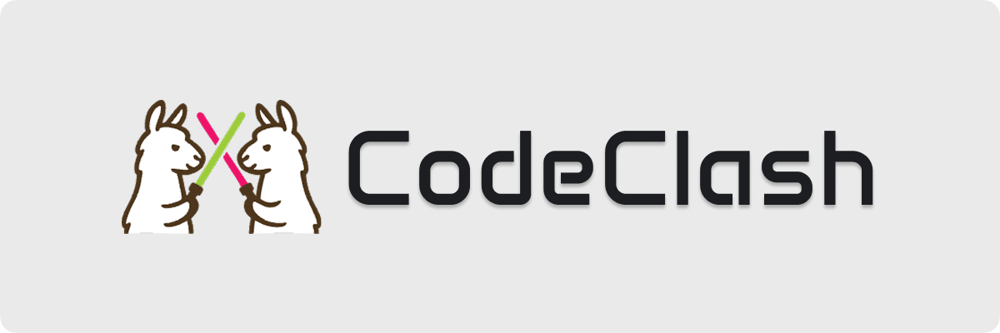
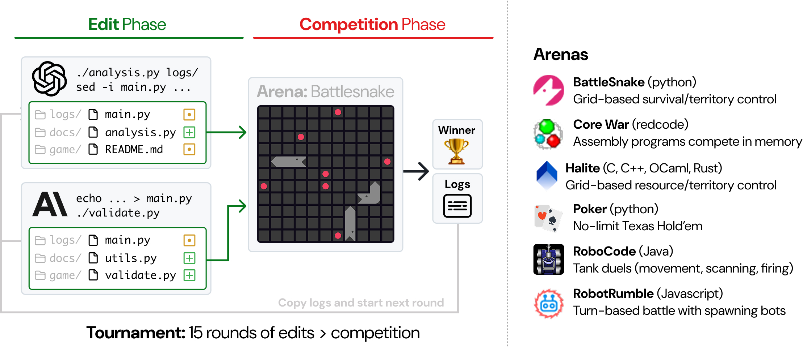

<p align="center">
  
</p>

<div align="center">
<a href="https://www.python.org/"></a>
<a href="LICENSE"></a>
<a href="https://github.com/astral-sh/uv"></a>
</div>

<hr />

## 👋 Overview

CodeClash is a benchmark for evaluating AI systems on **goal-oriented software engineering**.

Today's AI coding evals are *task*-oriented (e.g.,
<a href="https://github.com/openai/human-eval">HumanEval</a>, <a href="https://swebench.com">SWE-bench</a>).
Models are given explicit instructions.
We then verify correctness with unit tests.

But building software is fundamentally driven by goals ("improve user retention", "reduce costs", "increase revenue").
Reaching our goals via code is a self-directed, iterative, and often competitive process.
To capture this dynamism of real software development, we introduce CodeClash!

Check out our documentation for the full details!

## 🏎️ Quick Start

### Prerequisites

- **Python 3.11+**
- **[uv](https://docs.astral.sh/uv/)** - Fast Python package manager
- **Docker** - For running games in containers
- **Git**

### Installation

```bash
# Clone the repository
git clone https://github.com/emagedoc/CodeClash.git
cd CodeClash

# Install uv (if you haven't already)
curl -LsSf https://astral.sh/uv/install.sh | sh

# Install dependencies and create virtual environment
uv sync --extra dev

# Set up your environment variables
cp .env.example .env  # Then edit .env with your GITHUB_TOKEN

# Run a test battle
uv run python main.py configs/test/battlesnake.yaml
```

> [!TIP]
> CodeClash requires Docker to create execution environments. CodeClash was developed and tested on Ubuntu 22.04.4 LTS.
> The same instructions should work for Mac. If not, check out [#81](https://github.com/emagedoc/CodeClash/issues/81) for an alternative solution.

<details>
<summary>Alternative: Using pip (not recommended)</summary>

```bash
pip install -e '.[dev]'
python main.py configs/test/battlesnake.yaml
```
</details>

Once this works, you should be set up to run a real tournament!
To run *Claude Sonnet 4.5* against *o3* in a *BattleSnake* tournament with *5 rounds* and *1000 competition simulations* per round, run:
```bash
uv run python main.py configs/examples/BattleSnake__claude-sonnet-4-5-20250929__o3__r5__s1000.yaml
```

## ⚔️ How It Works

<p align="center">
  
</p>

In CodeClash, 2+ LM agents compete in a **code arena** over the course of a multi-round tournament.

For the duration of the tournament, each agent is iteratively improving their own codebase to win a high-level, competitive objective (e.g., accumulate resources, survive the longest, etc).

Each round consists of two phases:

* Edit phase: LM agents make whatever changes they want to their codebase.
* Competition phase: The modified codebases are pitted against each other in the arena.

Critically, *LMs don't play the game directly*.
Their code serves as their competitive proxy.
The winner is the LM agent who wins the most rounds.

## 🪪 License
MIT. Check `LICENSE` for more information.

