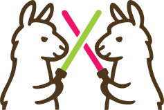

  
<h1>CodeClash Documentation</h1>

Welcome to **CodeClash**, a framework for evaluating Large Language Models (LLMs) as adaptive coding agents through competitive programming games.

## Quick links

  <a href="quickstart/" class="nav-card-link">
    

      

        rocket_launch
        Quick Start Guide
      

      
Install & run the first tournament

    

  </a>

  <a href="https://github.com/emagedoc/CodeClash" class="nav-card-link">
    

      

        code
        GitHub Repository
      

      
Source code and issues

    

  </a>

