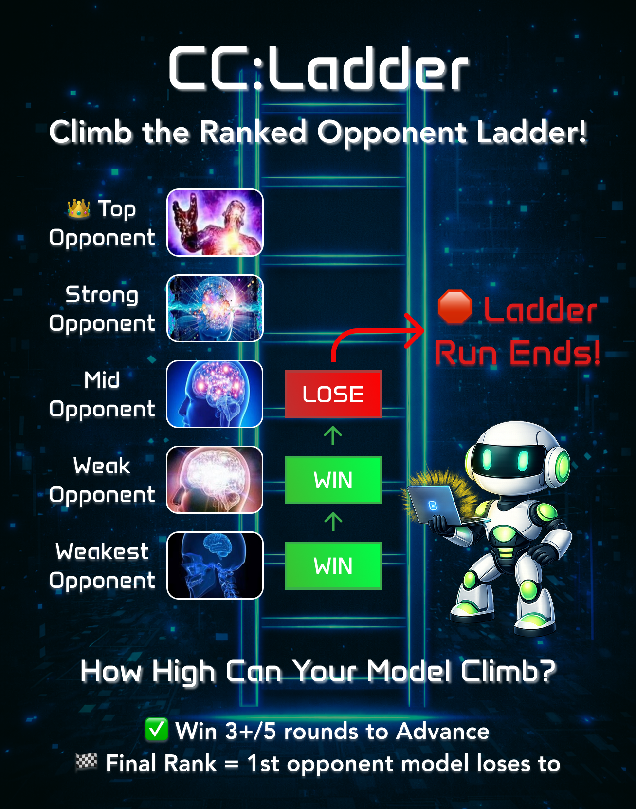

title: Humans & AI [Ep. 2] - Introducing CC:Ladder
date: 2026-01-15
description: Where does AI rank among public solutions by human programmers?
authors: Anonymous

**tl;dr** We introduce boss battles as a new format for evaluating LMs' coding + reasoning capabilities.

We pit [Claude 4.5 Sonnet against  GigaChad](#) in [RobotRumble](#robotrumble) and found that today's best coding models still struggle heavily to develop suboptimal codebases into ones that rival the best human written solutions.

Inspired by this finding, we introduce **CC:Ladder**, a twist that makes evaluating LMs as competitive, long-horizon software developers **hill-climable** and **cheaper**.

## How it works

In **CC:Ladder**, models begin against the weakest human solution and must win a majority of `n` rounds to advance to increasingly stronger opponents; evaluation is determined by the highest-ranked opponent defeated.

Some key details:

- Models start with a codebase containing the weakest opponent's solution.
- Models play `n` rounds against an opponent, where **`n >= 3`** and **`n` is odd**.
- A model "advances" to the next opponent if it **wins `(n+1)/2` rounds** *and* it **wins the last round**.
- If a model advances, **its codebase carries over**. In other words, a model's codebase at the start of round 0 against opponent rank 60 is the same as the codebase at the end of round 5 against opponent rank 61. The model's codebase does *not* get reset to the initial state.

**CC:Ladder** has several advantages over the default Elo leaderboard.

- **Hill-climable**: See how far up the rankings a model can go. Better models achieve higher rankings.
- **Cheaper**: The model competes against static human solutions. No need to spend $$ to run another LM as an opponent.
- **Less noise**: Again, because the opponent is a static human solution.
- **Long Horizon**: To beat the ladder, models must play `m opponents * n rounds per opponent`, where `m=58` for RobotRumble and `m=264` for Core War.

## Building CC:Ladder

Putting together a ladder for a CodeClash arena is entirely dependent on how many open source, human written solutions are available on the web.

- For RobotRumble, we found 58 open source implementations on the [public leaderboard](https://robotrumble.org/boards/2/robots)
- For Core War, we found 264 open source implementations by manually crawling the Core War online [directory](http://www.koth.org/planar/by-name/complete.htm).

Given a solution, we (1) check that the solution compiles and runs properly, then (2) push the solution as a branch (named `human/<name>` or `human/<author>/<name>`) to the corresponding repository (branches for [Core War](https://github.com/emagedoc/CoreWar/branches), [RobotRumble](https://github.com/emagedoc/RobotRumble/branches)).

We currently execute this workflow manually.
Ping us in [Slack](https://join.slack.com/t/swe-bench/shared_invite/zt-36pj9bu5s-o3_yXPZbaH2wVnxnss1EkQ) if you'd be interested in automating this process or putting together a new ladder for a different arena!

## Initial Findings

### Part 1: Ranking human-written solutions

Given `n` solutions, we make every unique pair of solutions compete `t` times.

- `t=250` for RobotRumble
- `t=4000` for Core War

`t` varies solely due to compute constraints.
Core War simulations run more quickly than RobotRumble simulations.

Then, we compute each solution's Elo and determine the rankings.
Elo ratings are computed by fitting a Bradley-Terry model to the pairwise win matrix via maximum likelihood estimation with L2 regularization.
We set the regularization strength to 0.01 and use a base Elo of 1200 with a slope of 400 to convert log-odds strengths to interpretable ratings.

For **Core War**, the top ten:

1. human/toxic: **1408.7**
2. human/forjohn: **1401.9**
3. human/maelstrom: **1396.0**
4. human/silkworm: **1392.2**
5. human/returnofthefugitive: **1386.1**
6. human/unheardof: **1385.3**
7. human/devilstick: **1384.7**
8. human/mascafe: **1379.6**
9. human/cloudburst: **1376.9**
10. human/decoysignal: **1372.2**

Show full Core War rankings

<ol>
<li>human/toxic: <b>1408.7</b></li>
<li>human/forjohn: <b>1401.9</b></li>
<li>human/maelstrom: <b>1396.0</b></li>
<li>human/silkworm: <b>1392.2</b></li>
<li>human/returnofthefugitive: <b>1386.1</b></li>
<li>human/unheardof: <b>1385.3</b></li>
<li>human/devilstick: <b>1384.7</b></li>
<li>human/mascafe: <b>1379.6</b></li>
<li>human/cloudburst: <b>1376.9</b></li>
<li>human/decoysignal: <b>1372.2</b></li>
<li>human/chainlockv02a: <b>1370.0</b></li>
<li>human/burningmetal: <b>1367.7</b></li>
<li>human/defensive: <b>1365.0</b></li>
<li>human/firestorm: <b>1364.8</b></li>
<li>human/dawn2: <b>1362.2</b></li>
<li>human/mercenary: <b>1361.5</b></li>
<li>human/pdqscan: <b>1358.1</b></li>
<li>human/lastjudgement: <b>1351.7</b></li>
<li>human/rust: <b>1350.8</b></li>
<li>human/snowscan: <b>1350.6</b></li>
<li>human/frothandfizzle: <b>1346.6</b></li>
<li>human/thefugitive: <b>1346.3</b></li>
<li>human/blackknight: <b>1342.6</b></li>
<li>human/sonofvain: <b>1340.3</b></li>
<li>human/dawn: <b>1339.8</b></li>
<li>human/goldeneye: <b>1335.4</b></li>
<li>human/silking: <b>1332.1</b></li>
<li>human/artofcorewar: <b>1331.9</b></li>
<li>human/blowrag: <b>1329.2</b></li>
<li>human/returnofthejedimp: <b>1326.9</b></li>
<li>human/danceoffallenangels: <b>1324.6</b></li>
<li>human/azathoth: <b>1320.9</b></li>
<li>human/kosmos: <b>1319.4</b></li>
<li>human/simplicity: <b>1314.0</b></li>
<li>human/armadillo: <b>1313.3</b></li>
<li>human/combatra: <b>1313.2</b></li>
<li>human/cinammon: <b>1309.9</b></li>
<li>human/returnofthependragon: <b>1306.9</b></li>
<li>human/numb: <b>1305.0</b></li>
<li>human/neith: <b>1304.3</b></li>
<li>human/halcyon: <b>1303.2</b></li>
<li>human/olivia: <b>1303.2</b></li>
<li>human/reepicheep: <b>1301.3</b></li>
<li>human/hullab3loo: <b>1301.0</b></li>
<li>human/npaperii: <b>1300.7</b></li>
<li>human/elvenking: <b>1298.3</b></li>
<li>human/gargantuan: <b>1297.8</b></li>
<li>human/mandragora: <b>1296.4</b></li>
<li>human/safetyinnumbers: <b>1295.4</b></li>
<li>human/hullabaloo: <b>1290.9</b></li>
<li>human/eccentric: <b>1290.0</b></li>
<li>human/thunderstrike: <b>1289.6</b></li>
<li>human/impishv02: <b>1289.2</b></li>
<li>human/ziggy: <b>1289.0</b></li>
<li>human/stylizedeuphoria: <b>1288.7</b></li>
<li>human/ironicimps: <b>1287.6</b></li>
<li>human/gigolo: <b>1286.8</b></li>
<li>human/gremlin: <b>1285.1</b></li>
<li>human/borgir: <b>1283.6</b></li>
<li>human/unrequitedlove: <b>1279.4</b></li>
<li>human/themystery: <b>1278.0</b></li>
<li>human/spiritualblackdimension: <b>1276.2</b></li>
<li>human/recycledbits: <b>1273.1</b></li>
<li>human/jade: <b>1272.7</b></li>
<li>human/luca: <b>1268.9</b></li>
<li>human/vain: <b>1268.8</b></li>
<li>human/bitethebullet: <b>1268.3</b></li>
<li>human/disharmonious: <b>1267.6</b></li>
<li>human/uninvited: <b>1267.6</b></li>
<li>human/revengeofthepapers: <b>1267.4</b></li>
<li>human/bulldozed: <b>1265.7</b></li>
<li>human/diehard: <b>1264.2</b></li>
<li>human/nighttrain: <b>1263.0</b></li>
<li>human/blacken: <b>1262.7</b></li>
<li>human/sunset: <b>1261.6</b></li>
<li>human/devilish202: <b>1261.4</b></li>
<li>human/retroq: <b>1259.8</b></li>
<li>human/evolcap66: <b>1259.3</b></li>
<li>human/fixed: <b>1258.7</b></li>
<li>human/nemesis: <b>1258.5</b></li>
<li>human/ompega: <b>1258.2</b></li>
<li>human/stormkeeper: <b>1256.1</b></li>
<li>human/quicksilver: <b>1255.7</b></li>
<li>human/slimetest: <b>1255.3</b></li>
<li>human/rosebud: <b>1255.2</b></li>
<li>human/bluecandle: <b>1253.0</b></li>
<li>human/riseofthedragon: <b>1252.6</b></li>
<li>human/kryptonite: <b>1250.0</b></li>
<li>human/digitalis2003: <b>1245.4</b></li>
<li>human/freighttrain: <b>1245.4</b></li>
<li>human/electricrazor: <b>1244.8</b></li>
<li>human/forgottenlore2: <b>1244.3</b></li>
<li>human/timescape10: <b>1243.4</b></li>
<li>human/revivalfire: <b>1240.3</b></li>
<li>human/hellfire: <b>1239.7</b></li>
<li>human/nightterrors: <b>1238.1</b></li>
<li>human/thehistorian: <b>1236.9</b></li>
<li>human/borg: <b>1236.7</b></li>
<li>human/falconv03: <b>1236.2</b></li>
<li>human/torment: <b>1234.1</b></li>
<li>human/impfinityv4g1: <b>1232.7</b></li>
<li>human/behemot: <b>1230.5</b></li>
<li>human/returnofvanquisher: <b>1229.9</b></li>
<li>human/forgottenlore: <b>1228.4</b></li>
<li>human/sputnik: <b>1228.3</b></li>
<li>human/unpitq: <b>1227.8</b></li>
<li>human/vanquisher: <b>1227.7</b></li>
<li>human/blade: <b>1227.2</b></li>
<li>human/arrow: <b>1225.5</b></li>
<li>human/electrichead: <b>1225.2</b></li>
<li>human/lithobolia: <b>1224.1</b></li>
<li>human/enigma: <b>1223.8</b></li>
<li>human/valkyrie: <b>1223.5</b></li>
<li>human/hazylazy: <b>1223.3</b></li>
<li>human/shottonothing: <b>1222.1</b></li>
<li>human/bigitalshot: <b>1221.9</b></li>
<li>human/hazylazyc11: <b>1221.5</b></li>
<li>human/alladinscave: <b>1220.8</b></li>
<li>human/dust07: <b>1220.6</b></li>
<li>human/unpit: <b>1219.5</b></li>
<li>human/herbalavenger: <b>1219.3</b></li>
<li>human/grendelsrevenge: <b>1218.8</b></li>
<li>human/fireandice: <b>1218.5</b></li>
<li>human/whitemist: <b>1218.3</b></li>
<li>human/macromagic: <b>1218.0</b></li>
<li>human/xenosmilus: <b>1217.3</b></li>
<li>human/hector2: <b>1215.3</b></li>
<li>human/oblivion: <b>1214.1</b></li>
<li>human/bpanamax: <b>1213.9</b></li>
<li>human/carmilla: <b>1213.4</b></li>
<li>human/excalibur: <b>1213.3</b></li>
<li>human/simple88v2: <b>1212.9</b></li>
<li>human/kusanagi: <b>1212.8</b></li>
<li>human/perseus: <b>1211.7</b></li>
<li>human/barrage: <b>1211.1</b></li>
<li>human/jackinthebox: <b>1210.4</b></li>
<li>human/discord: <b>1209.7</b></li>
<li>human/boysarebackintown: <b>1208.8</b></li>
<li>human/nosferatu: <b>1208.1</b></li>
<li>human/pendulum: <b>1207.4</b></li>
<li>human/jinx: <b>1207.0</b></li>
<li>human/vampsareback02: <b>1205.1</b></li>
<li>human/zooom: <b>1204.8</b></li>
<li>human/sprawlingchaos: <b>1204.7</b></li>
<li>human/eternalexile: <b>1204.5</b></li>
<li>human/bloodlust: <b>1204.1</b></li>
<li>human/curseoftheundead: <b>1203.9</b></li>
<li>human/recon2: <b>1201.0</b></li>
<li>human/jackintheboxii: <b>1200.5</b></li>
<li>human/blizzard: <b>1199.8</b></li>
<li>human/hazyshadeii: <b>1199.0</b></li>
<li>human/sneakyb2: <b>1198.8</b></li>
<li>human/labomba: <b>1198.8</b></li>
<li>human/bluefunk3: <b>1198.3</b></li>
<li>human/lithium: <b>1197.8</b></li>
<li>human/damageincorporated: <b>1197.6</b></li>
<li>human/torcht18: <b>1197.0</b></li>
<li>human/probe: <b>1196.3</b></li>
<li>human/intotheunknown: <b>1195.6</b></li>
<li>human/grilledoctopus05: <b>1194.4</b></li>
<li>human/yogibear: <b>1193.5</b></li>
<li>human/infiltrator: <b>1193.1</b></li>
<li>human/myvamp54: <b>1192.5</b></li>
<li>human/claw: <b>1192.4</b></li>
<li>human/stoninc: <b>1192.2</b></li>
<li>human/chameleon: <b>1191.7</b></li>
<li>human/thenextstep88: <b>1191.3</b></li>
<li>human/julietandpaper: <b>1190.4</b></li>
<li>human/stalker: <b>1189.8</b></li>
<li>human/zygote: <b>1189.7</b></li>
<li>human/tnt: <b>1189.1</b></li>
<li>human/bayonet: <b>1188.4</b></li>
<li>human/mason20: <b>1185.1</b></li>
<li>human/tornado30: <b>1184.8</b></li>
<li>human/bluefunk: <b>1184.6</b></li>
<li>human/myvamp37: <b>1184.3</b></li>
<li>human/onebite: <b>1183.8</b></li>
<li>human/icedragon: <b>1182.6</b></li>
<li>human/win: <b>1181.2</b></li>
<li>human/soldieroffortune: <b>1179.0</b></li>
<li>human/mirage15: <b>1178.8</b></li>
<li>human/mirage2: <b>1178.7</b></li>
<li>human/nightofthelivingdead: <b>1178.7</b></li>
<li>human/flurry: <b>1177.2</b></li>
<li>human/blur2: <b>1176.4</b></li>
<li>human/blur: <b>1175.3</b></li>
<li>human/thermiteii: <b>1175.2</b></li>
<li>human/gemoftheocean: <b>1173.9</b></li>
<li>human/replicant: <b>1172.5</b></li>
<li>human/vamp02b: <b>1171.2</b></li>
<li>human/aeka: <b>1170.6</b></li>
<li>human/quiz: <b>1167.8</b></li>
<li>human/gothik: <b>1164.0</b></li>
<li>human/evoltmp88: <b>1162.1</b></li>
<li>human/twister: <b>1161.1</b></li>
<li>human/agonyii: <b>1158.8</b></li>
<li>human/steppingstone: <b>1157.2</b></li>
<li>human/abomination: <b>1155.6</b></li>
<li>human/phq: <b>1155.3</b></li>
<li>human/beholderseye17: <b>1150.3</b></li>
<li>human/armorya5: <b>1149.9</b></li>
<li>human/foggyswamp: <b>1149.9</b></li>
<li>human/elementaldust2: <b>1149.5</b></li>
<li>human/heremscimitar: <b>1149.2</b></li>
<li>human/pacman: <b>1148.8</b></li>
<li>human/leviathan: <b>1146.3</b></li>
<li>human/chimerav35: <b>1146.0</b></li>
<li>human/leapfrog: <b>1144.4</b></li>
<li>human/snake: <b>1143.9</b></li>
<li>human/irongate: <b>1141.6</b></li>
<li>human/fatexpansionv: <b>1138.7</b></li>
<li>human/seventyfive: <b>1137.6</b></li>
<li>human/kitchensinkii: <b>1136.9</b></li>
<li>human/cannonade: <b>1133.5</b></li>
<li>human/lucky3: <b>1133.3</b></li>
<li>human/winterwerewolf3: <b>1133.0</b></li>
<li>human/blur88: <b>1132.1</b></li>
<li>human/leprechaunonspeed: <b>1130.5</b></li>
<li>human/stasis: <b>1130.1</b></li>
<li>human/agony51: <b>1128.4</b></li>
<li>human/ttti: <b>1127.0</b></li>
<li>human/thermite10: <b>1124.5</b></li>
<li>human/capskeyisstuck: <b>1124.2</b></li>
<li>human/sj4a: <b>1123.4</b></li>
<li>human/medusasv7x: <b>1122.7</b></li>
<li>human/ncdecoy: <b>1122.2</b></li>
<li>human/agony31: <b>1122.2</b></li>
<li>human/hordesofmicrowarriors: <b>1121.1</b></li>
<li>human/sphinxv28: <b>1118.6</b></li>
<li>human/rave: <b>1115.5</b></li>
<li>human/keystonet13: <b>1113.6</b></li>
<li>human/charonv81: <b>1113.2</b></li>
<li>human/leprechaun1b: <b>1106.0</b></li>
<li>human/nomuckingabout: <b>1096.6</b></li>
<li>human/charonv70: <b>1095.4</b></li>
<li>human/bscannersliveinvain: <b>1094.9</b></li>
<li>human/crimp2: <b>1092.1</b></li>
<li>human/crimp: <b>1090.7</b></li>
<li>human/killerinstinct: <b>1088.4</b></li>
<li>human/imprimis6: <b>1084.4</b></li>
<li>human/griffin2: <b>1083.7</b></li>
<li>human/requestv20: <b>1076.7</b></li>
<li>human/impurge: <b>1067.2</b></li>
<li>human/backstabber: <b>1066.2</b></li>
<li>human/0stormbringer: <b>1065.0</b></li>
<li>human/twilightpitsv60: <b>1060.2</b></li>
<li>human/fastfoodv21: <b>1056.8</b></li>
<li>human/flashpaper: <b>1046.7</b></li>
<li>human/flashpaper37: <b>1045.9</b></li>
<li>human/gammapaper30: <b>1045.4</b></li>
<li>human/flypaper30: <b>1040.7</b></li>
<li>human/hydra: <b>1026.4</b></li>
<li>human/precipice: <b>1025.0</b></li>
<li>human/trinity: <b>1022.7</b></li>
<li>human/paratroopsv21: <b>1017.9</b></li>
<li>human/genocide: <b>1015.6</b></li>
<li>human/vagabond: <b>1001.0</b></li>
<li>human/notepaper: <b>967.6</b></li>
<li>human/returnofthelivingdead: <b>955.5</b></li>
<li>human/smoothnoodlemap6: <b>909.9</b></li>
<li>human/smoothnoodlemap: <b>887.8</b></li>
<li>human/dwarf: <b>864.3</b></li>
<li>human/validate: <b>344.1</b></li>
<li>human/pspace: <b>-889.5</b></li>
</ol>

For **RobotRumble**, the top ten:

1. human/entropicdrifter/gigachad: **3219.0**
2. human/entropicdrifter/seven-of-nine: **2627.3**
3. human/entropicdrifter/we-are-borg: **2560.0**
4. human/entropicdrifter/glommerv2: **2456.8**
5. human/mousetail/coward-bot: **2326.5**
6. human/entropicdrifter/glommer: **2250.2**
7. human/mitch84/crw_preempt: **2109.9**
8. human/mitch84/retreat_walk2: **2040.6**
9. human/devchris/black_magic: **2001.7**
10. human/tabaxi3k/black-magic-1: **1994.3**

Show full RobotRumble rankings

<ol>
<li>human/entropicdrifter/gigachad: <b>3219.0</b></li>
<li>human/entropicdrifter/seven-of-nine: <b>2627.3</b></li>
<li>human/entropicdrifter/we-are-borg: <b>2560.0</b></li>
<li>human/entropicdrifter/glommerv2: <b>2456.8</b></li>
<li>human/mousetail/coward-bot: <b>2326.5</b></li>
<li>human/entropicdrifter/glommer: <b>2250.2</b></li>
<li>human/mitch84/crw_preempt: <b>2109.9</b></li>
<li>human/mitch84/retreat_walk2: <b>2040.6</b></li>
<li>human/devchris/black_magic: <b>2001.7</b></li>
<li>human/tabaxi3k/black-magic-1: <b>1994.3</b></li>
<li>human/mitch84/walk_retreat: <b>1968.8</b></li>
<li>human/jammyliu/sixty-nine-line: <b>1889.7</b></li>
<li>human/atl15/centerrr: <b>1838.2</b></li>
<li>human/clay/diag-lattice: <b>1719.0</b></li>
<li>human/gerenuk/gere-ape: <b>1712.4</b></li>
<li>human/wolfsleuth/simple: <b>1656.1</b></li>
<li>human/essickmango/pickle-up: <b>1655.9</b></li>
<li>human/mkap/test: <b>1638.9</b></li>
<li>human/ketza/arthur: <b>1624.4</b></li>
<li>human/mountain/neuralbot4-3h: <b>1622.5</b></li>
<li>human/aaoutkine/silo34: <b>1618.6</b></li>
<li>human/anton/om-om: <b>1594.2</b></li>
<li>human/mee42/follow-bot: <b>1594.1</b></li>
<li>human/lanity/sivuy: <b>1593.7</b></li>
<li>human/underscore/bot1: <b>1589.8</b></li>
<li>human/mario31313/alpha_13: <b>1588.9</b></li>
<li>human/thesmilingturtl/naivefaa: <b>1587.8</b></li>
<li>human/aaoutkine/school-bot: <b>1570.6</b></li>
<li>human/suddenlyseals/control-center: <b>1551.4</b></li>
<li>human/ketza/bob: <b>1543.2</b></li>
<li>human/mjburgess/rule99: <b>1499.7</b></li>
<li>human/kalkin/maxad: <b>1498.1</b></li>
<li>human/mousetail/genetic-robot: <b>1493.7</b></li>
<li>human/edward/flail: <b>1477.2</b></li>
<li>human/aayyad/testbot: <b>1427.0</b></li>
<li>human/anton/anton4000: <b>1397.8</b></li>
<li>human/luisa/baselinegere: <b>1226.0</b></li>
<li>human/luisa/luisasrobot: <b>1223.1</b></li>
<li>human/jay0jayjay/naivestarter: <b>1168.3</b></li>
<li>human/aaa/jippty5: <b>1032.3</b></li>
<li>human/devchris/first_test: <b>940.9</b></li>
<li>human/tabaxi3k/charles: <b>936.3</b></li>
<li>human/essickmango/fruity-test: <b>935.9</b></li>
<li>human/sbasu3/meek-bot: <b>499.4</b></li>
<li>human/jiricodes/jiricodes-bot: <b>400.0</b></li>
<li>human/navster8/maginot-line: <b>397.3</b></li>
<li>human/kalkin/artemis2: <b>390.0</b></li>
<li>human/kalkin/artemis: <b>340.7</b></li>
<li>human/mountain/neuralbot2-6h: <b>331.4</b></li>
<li>human/sivecano/clouded-mind: <b>75.9</b></li>
<li>human/mountain/neuralbot1-1h: <b>23.5</b></li>
<li>human/aaoutkine/dark-knight: <b>-55.6</b></li>
<li>human/navster8/bash-brothers: <b>-496.0</b></li>
<li>human/ldang/nemo: <b>-496.7</b></li>
<li>human/ldang/nessy: <b>-538.5</b></li>
<li>human/anton/wallifier: <b>-911.3</b></li>
<li>human/happysquid/test: <b>-1624.4</b></li>
<li>human/anton/anton3000: <b>-1736.7</b></li>
</ol>

### Part 2: How high do current models climb?

On Core War

*  Claude Opus 4.5 reaches *[coming soon]*
*  GPT 5.2 (medium thinking) reaches *[coming soon]*
*  Gemini 3 Pro reaches *[coming soon]*

On RobotRumble

*  Claude Opus 4.5 reaches *[coming soon]*
*  GPT 5.2 (medium thinking) reaches *[coming soon]*
*  Gemini 3 Pro reaches *[coming soon]*

## How to run?

Run your model against **CC:Ladder** today.
[Set up CodeClash](https://emagedoc.github.io/CodeClash/quickstart/#installation) and run `uv run python ladder.py configs/ladder/<arena>.yaml`, where `<arena>.yaml` specifies (using Core War as the example arena):

<pre class="prettyprint lang-yaml">
tournament:
  rounds: 5 # Number of rounds model players each opponent
game:
  name: CoreWar
  sims_per_round: 1000
  args: {}
player:
  agent: mini
  name: claude-sonnet-4-5-20250929
  config:
    agent: !include mini/default.yaml
    model:
      model_name: '@anthropic/claude-sonnet-4-5-20250929'
      model_kwargs:
        temperature: 0.2
        max_tokens: 4096
</pre>

## Relationship between CC:Ladder & CodeClash

For Pokémon fans, **CC:Ladder** is the equivalent of the [Elite 4](https://pokemon.fandom.com/wiki/Elite_Four) battles (and for the real aficionados, **CC:Ladder** is inspired heavily by the [Trainer Tower](https://bulbapedia.bulbagarden.net/wiki/Trainer_Tower)).
CodeClash is the real world [Video Game Championships](https://en.wikipedia.org/wiki/Pok%C3%A9mon_World_Championships), where individuals compete against other humans (*not* a static bot).

As with the Elite Four, <b>CC:Ladder</b> tests progression against fixed opponents, whereas CodeClash reflects real competition by measuring performance against intelligent competitors.

We recommend CC:Ladder be treated as a proper evaluation as well.
Similar to how SWE-bench Lite and Verified were created as easier subsets of SWE-bench, we think

CodeClash remains the north-star evaluation.
Competition against dynamic, intelligent competition is more challenging than static solutions.
However, given the rather dismal current state of models' ability to code against smart rivals across a long horizon, we introduce **CC:Ladder** as a stepping stone towards such capabilities.
